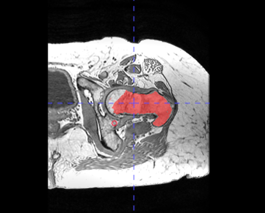
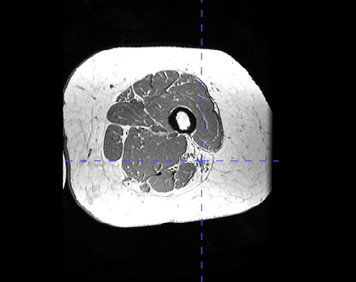

# This is a muscle segmentation pipeline.

Before procedding, make sure you have the following tools, including FSL, Mrtirx3, itksnap, python3 and python packages listed in the requirement.txt

We will take data in the '/home/sheng/RA/data/muscle_longitudinal' as example to run the following pipeline. 

```
muscle_longitudinal
│   
└───BL
│   │ 
│   |____raw
│       |        
│       |___Ax_T1
│           |  IM-0001-0001.dcm
│           |  IM-0001-0002.dcm
│           |  ...
└───FU
    │
    │___raw
        |
        |___Ax_3D_T1_3
            |  IM-0001-0001.dcm
            |  IM-0001-0002.dcm
            |  ...
```

From the above, you can observe there are two main folders called 'BL' and 'FU', which indicates baseline data and followup data, respectively. For each of them, there is a 'raw' folder inside, which contains the corresponding 'Ax_T1' (folder of unprocessed T1-weighted data). In 'Ax_T1', all files are ended in .dcm. 

## 1. Setup the environment

Before running specific operations, let's first setup the environment

```
cd /home/sheng/RA/data/muscle_longitudinal
code_root=/home/sheng/RA/Myositis_muscle_pipline
bl_root=/home/sheng/RA/data/muscle_longitudinal/BL
fu_root=/home/sheng/RA/data/muscle_longitudinal/FU
```

Now, let's start following operations

## 2. Convert dicom to nii

After getting the raw data, which usually ends in .dcm, you need to convert it into .nii.gz to make convenience for afterwards operations.
An example is provided in [mrtrix3](https://mrtrix.readthedocs.io/en/dev/tips_and_tricks/dicom_handling.html)

```
mrconvert [input_dir_of_dcm_files] [output_path/converted.nii.gz]
```

For our example, please see the code below.

```
mrconvert $bl_root/raw/Ax_T1  $bl_root/raw/bl_thigh.nii.gz -force
mrconvert $fu_root/raw/Ax_3D_T1_3  $fu_root/raw/fu3_thigh.nii.gz -force
```

We have now converted the raw baseline and followup data into the corresponding bl_thigh.nii.gz and fu3_thigh.nii.gz, respectively.

bl_thigh            |  FU3_thigh
:-------------------------:|:-------------------------:
  |  


## 2. Split left and right thighs

The original data consists of left and right thighs together, you need to split them into left_thigh and right_thigh from the middle, respectively.

```
python3 split_middle.py -f [target_path/converted.nii.gz]
```

The above command will generate two files at [target_path] with the name of converted_left.nii.gz and converted_right.nii.gz, respectively.

For our example, please see the code below.
```
python3 $code_root/split_middle.py -f $bl_root/raw/bl_thigh.nii.gz
python3 $code_root/split_middle.py -f $fu_root/raw/fU3_thigh.nii.gz
```

bl_thigh_left/right            |  FU3_thigh_left/right
:-------------------------:|:-------------------------:
  |  


Now we have generated 4 files, including bl_thigh_left.nii.gz, bl_thigh_right.nii.gz, fU3_thigh_left.nii.gz, and fU3_thigh_right.nii.gz

You can use 'mrview' command or itksnap to take a look of the splitted thigh.

## 3. Femur segmentation
If you only need to deal with baseline images and without followup data, then you can skip this step. Otherwise, you need to apply following operations to both baseline and followup images.

We will take a baseline image as an example, but don't forget followup ones later!

1. Open the itksnap.

2. Load the image.


3. Use the 'snake' tool to bound the intrest area around the femur. You need to adjust the bounding box in three views respectively to make the bounding box to fit the femur as close as possible.


4. Click 'Segment 3D' (indicates by the mouse cursor) on the left column.


5. Modify the lower and upper threshold. Remember that the blue color indicates the background and white color indicates foreground. We want the femur (white) to be surrounded by blue color.


You need to check three views respectively to make femur covered by white color and the surrounding areas of femur covered by blue color such that the algorithm will not connect unexpected areas.

6. Click 'Next' (indicates by the mouse cursor).


7. Click 'Add bubble at cursor' and modify the bubble radius. The bubble at curosr should not exceed the femur.


8. Click 'Next' (indicates by the mouse cursor).


9. Now click 'run' and monitor the progress. You can modify the step size to change the growing speed. When monitoring the process, if you see the growing regions are not as expected, you shuold return to step 5.


You may also notice that some femur are not connected, we will fix that with manually annotation in the following step.

10. You now need to check the axial view slice by slice and use the 'brush' tool to complete missing femur.

Before manual annotation           |  After manual annotation
:-------------------------:|:-------------------------:
  |  

After finishing all steps above, you will got 4 femur masks, including 'bl_femur_left.nii.gz', 'bl_femur_right.nii.gz', 'fu3_femur_left.nii.gz', and 'fu3_femur_right.nii.gz'.

## 4. Registration

We now want to align the followup data with the baseline data. Thus, the registration tool 'flirt' will be used.
The official documentation is provided as [flirt](https://web.mit.edu/fsl_v5.0.10/fsl/doc/wiki/FLIRT(2f)UserGuide.html).

We will take the left thigh as an example, you should also apply the similar process to the right thigh later.

1. Registrate followup femur to baseline femur and output the tranformation matrix
```
flirt -in $fu_root/raw/fu3_femur_left.nii.gz \
-ref $bl_root/raw/bl_femur_left.nii.gz \
-out $fu_root/raw/fu3_femur_left_ref2bl.nii.gz \
-omat $fu_root/raw/fu3_femur_left_ref2bl.mat \
-dof 6
```

'-in' is the input image (Currently, it will be followup femur).
'-ref' is the reference image (Currently, will be baseline femur).
'-out' is the transformed output (Currently, it will be registered followup femur).
'-omat' is the calculated transformation matrix, ended in .mat. 
'-dof' is the degree of freedom to regulate the registration process, default is 6.

2. Apply the transformatoin matrix to followup thigh to get the transformed followup data
```
flirt -in $fu_root/raw/fu3_thigh_left.nii.gz \
-applyxfm \
-init $fu_root/raw/fu3_femur_left_ref2bl.mat \
-ref $bl_root/raw/bl_femur_left.nii.gz \
-out $fu_root/raw/fu3_thigh_left_ref2bl.nii.gz
```

'-in' is the input image (Currently, it will be followup thigh, instead of femur !!!!).
'-applyxfm' is the arg to tell flirt using the existing transformation matrix.
'-init' is the transformation matrix you want to apply.
'-ref' is the reference image (It is still baseline femur).
'-out' is the transformed out (Currently, it will be registered followup thigh, instead of femur !!!!)

After registration, you have successfully aligned the followup and baseline data. You can now do further analysis.

bl_left          |  fu3_left_ref2bl
:-------------------------:|:-------------------------:
  |  


## 5. Crop ROIs
We need to crop ROIs for both baseline and followup data. According to the [paper](https://link.springer.com/chapter/10.1007/978-3-030-00807-9_2), the ROI is located between the axial slice immediately superior to the patella and the inferior border of the gluteus maximus muscle.

We will take baseline together with followup left thigh data as an example, you should apply the same process to the right thigh later.

1. Open the itksnap.
2. Load the baseline image.
3. Check the axial view to inspect the ROI.
4. Record the corresponding slice position of ROI in axial view.
5. Run the following commands.

Inferior border of the gluteus maximus muscle          |  ROI1
:-------------------------:|:-------------------------:
  |  


Superior to the patella       |  ROI2
:-------------------------:|:-------------------------:
  |  

The bio markers are indicated by the blue cross.

```
python3 $code_root/crop_roi.py \
-f $bl_root/raw/bl_thigh_left.nii.gz \
-b 65 \
-t 275
```

```
python3 /home/sheng/RA/Myositis_muscle_pipline/sandbox/crop_roi.py \
-f $fu_root/raw/fu3_thigh_left_ref2bl.nii.gz \
-b 65 \
-t 275 
```

The first command will generate the roi of the baseline data: '/home/sheng/RA/data/muscle_longitudinal/BL/raw/bl_thigh_left_roi.nii.gz'. The second command will generate the roi of the followup data: '/home/sheng/RA/data/muscle_longitudinal/FU/raw/fu3_thigh_left_ref2bl_roi.nii.gz'.

Since we have registered the followup to baseline, the position of ROI will be the same. That's the reason we only need to inspect the baseline data.

## 6. N4 Bias Correction

We now need to apply the bias correction to baseline and followup data. This is to address the inhomogenity issue for better muscle mask generation in later steps. The adopted 'N4' tool is explained in the [offical documentation](https://github.com/ANTsX/ANTs/wiki/N4BiasFieldCorrection).

We will take baseline left thigh roi as an example, you should apply the same process to other rois.

```
N4BiasFieldCorrection \
-i /home/sheng/RA/data/muscle_longitudinal/BL/raw/bl_thigh_left_roi.nii.gz \
-o /home/sheng/RA/data/muscle_longitudinal/BL/raw/bl_thigh_left_roi_N4.nii.gz
```

In this command, '-i' is input, and '-o' is the output.

Before N4       |  After N4
:-------------------------:|:-------------------------:
  |  


## 7. Mask Generation

You can now use the trained model to generate thigh muscle masks. I will take the baseline left thigh data as an example.

```
python3 /home/sheng/RA/Myositis_muscle_pipline/sandbox/predict_mask.py \
-i /home/sheng/RA/data/muscle_longitudinal/BL/raw/bl_thigh_left_roi_N4.nii.gz \
-o /home/sheng/RA/data/muscle_longitudinal/BL/raw/bl_thigh_left_roi_N4_mask.nii.gz
```

## 8. Mask Refine.

This step is to refine the muscle mask by mannual inspection.

1. Open itksnap.
2. Load the predict mask.
3. Check the axial view slice by slice and use the 'brush' tool to complete missing thigh mask.


